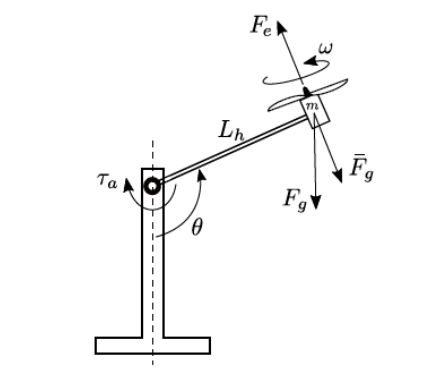

# Projeto Inicial: Projeto Final Controle de Sistemas Lineares

> O projeto iniciou-se como parte da disciplina Controle de Sistemas Lineares, com o objetivo da criação de um controlador clássico (LGR, Resposta em Frequência, etc) e um controlador PID 
> para estrutura acima, em uma certa condição de equilíbrio, sendo, neste caso, theta igual à 80º.

### Conteúdo

O projeto, atualmente finalizado e entregue, conta com:

- [x] Linearização do modelo não linear
- [x] Análise do comportamento em malha aberta
- [x] Simulação do modelo não linear no Matlab
- [x] Projeto de controlador com LGR
- [x] Projeto de controlador PID
- [x] Simulação do modelo com controladores
- [x] Relatório final 

## 💻 Utilização

Antes de começar, verifique se você atendeu aos seguintes requisitos:
* Você instalou a versão mais recente do Matlab
* Você tem uma máquina Windows
* Você leu [Relatório Final](https://github.com/luis-cmenezes/aeropendulum-control/blob/main/projeto-final/Relat%C3%B3rio%20Final%20-%20Luis%20Felipe%20Costa%20Fernandes%20de%20Menezes.pdf)

Concluídos os requisitos, todos os arquivos desta parte do projeto estão na pasta "projeto-final".

# Reiteração: Construção, modelagem por Resposta em Frequência e controle no Espaço de Estados
Partindo da mesma estrutura a ser controlada, o objetivo desta reiteração é não só cobrir etapas não realizadas na parte inicial, como construção e modelagem, como também reforçar e explorar ramos do Controle de Sistemas Lineares não exeplorados anteriormente, como resposta em frequência e controladores no espaço de estados.

### Etapas

A reiteração do projeto contará com os seguintes passos:

- [ ]  Projeto do circuito eletrônico
- [ ]  Modelagem e impressão da estrutura
- [ ]  Identificação do modelo por resposta em frequência
- [ ]  Criação de um controlador no SS através do modelo obtido
- [ ]  Documentação do projeto
